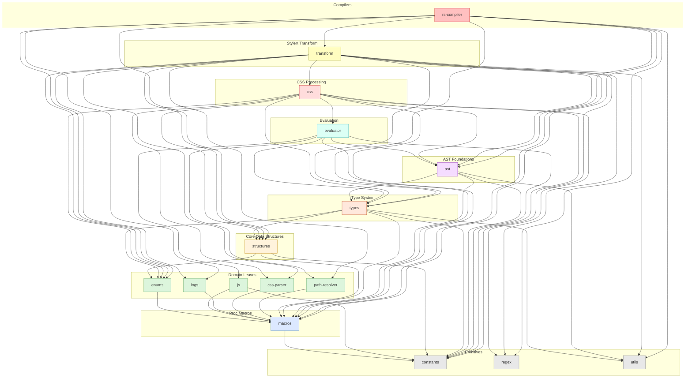

# StyleX in Rust &middot; [](https://github.com/Dwlad90/stylex-swc-plugin/blob/develop/LICENSE) [](https://www.npmjs.com/package/@stylexswc/rs-compiler)  

> **Community-driven, high-performance StyleX compiler and tooling ecosystem built with Rust**

> [!IMPORTANT]
> This is a **community-written** implementation of StyleX tooling. Built with love by the open source community, it aims to provide a high-performance alternative to the official StyleX tooling while not being affiliated with or officially supported by Meta/Facebook.

A comprehensive monorepo providing a community-built [`napi-rs`](https://napi.rs/) compiler, [SWC](https://swc.rs/) plugin, and complete CSS parser for [StyleX](https://github.com/facebook/stylex). Built from the ground up in Rust for maximum performance and developer experience.

## 🚀 Why StyleX + Rust?

- **⚡ Blazing Fast**: Significantly faster build times by leveraging NAPI-RS/SWC instead of Babel
- **🔧 Performance-First Alternative**: Built from the ground up in Rust for maximum speed and efficiency
- **🧩 Modular Architecture**: 17 atomic Rust crates with strict dependency layering for maximum parallel compilation and surgical rebuilds
- **📦 Complete Ecosystem**: Community-built toolkit covering compilation to CSS parsing
- **🌐 Universal Integration**: Works seamlessly with Next.js, Webpack, Vite, Rollup, and more
- **🛡️ Type Safe**: Full Rust implementation with comprehensive error handling
- **🤝 Community Driven**: Open source with active community contributions and support

Perfect for developers who want blazing-fast StyleX compilation and are excited about Rust-powered tooling!

## 📦 Quick Start

```bash
# For Next.js projects
npm install --save-dev @stylexswc/nextjs-plugin

# For other build tools
npm install --save-dev @stylexswc/unplugin
```

### Next.js Setup

#### Using with Webpack (Default)

```javascript
// next.config.js
const stylexPlugin = require('@stylexswc/nextjs-plugin');

module.exports = stylexPlugin({
  rsOptions: {
    dev: process.env.NODE_ENV !== 'production',
  },
})();
```

#### Using with Turbopack

```typescript
// next.config.ts
import stylexPlugin from '@stylexswc/nextjs-plugin/turbopack';

export default stylexPlugin({
  rsOptions: {
    dev: process.env.NODE_ENV !== 'production',
  },
})();
```

## 📁 Project Architecture

This monorepo is organized into a layered, strictly-scoped crate
graph designed for maximum parallel compilation and clear domain
boundaries. Each Rust crate owns exactly one concern — no re-export
facades, no mixed-domain files.

### 🔥 Core Engines

The compiler pipeline is built from 17 atomic Rust crates arranged in
a strict dependency DAG. Higher layers depend only on lower layers —
never the reverse.

#### Layer 0 — Primitives (no internal dependencies)

- **[`stylex-constants`](./crates/stylex-constants)** — Static lookup tables, keyword sets, and compile-time constants
- **[`stylex-regex`](./crates/stylex-regex)** — Pre-compiled `lazy_static!` regex patterns for CSS value matching
- **[`stylex-utils`](./crates/stylex-utils)** — Lightweight SWC AST helpers

#### Layer 1 — Macros

- **[`stylex-macros`](./crates/stylex-macros)** — Error-handling and diagnostic macros (`stylex_panic!`, `stylex_bail!`, `stylex_unwrap!`, etc.)

#### Layer 2 — Domain Leaves

- **[`stylex-enums`](./crates/stylex-enums)** — 14 enum modules: `CSSSyntax`, `ValueWithDefault`, `ImportPathResolution`, `StyleVarsToKeep`, and more
- **[`stylex-js`](./crates/stylex-js)** — JS runtime guard helpers (`is_valid_callee`, `is_mutation_expr`, `is_invalid_method`)
- **[`stylex-logs`](./crates/stylex-logs)** — Structured logging with ANSI-colored `[StyleX]`-branded output for the NAPI-RS pipeline
- **[`stylex-css-parser`](./crates/stylex-css-parser)** — High-performance CSS value parser with comprehensive type, property, and at-rule coverage
- **[`stylex-path-resolver`](./crates/stylex-path-resolver)** — Import path resolution with partial `package.json` exports support

#### Layer 3 — Core Data Structures

- **[`stylex-structures`](./crates/stylex-structures)** — 15 foundational struct modules: `StylexOptions`, `UidGenerator`, `PluginPass`, `NamedImportSource`, `Order`, and more

#### Layer 4 — Type System

- **[`stylex-types`](./crates/stylex-types)** — Cross-coupled core types (`InjectableStyle*`, `MetaData`) and the `StyleOptions` trait

#### Layer 5 — AST Foundations

- **[`stylex-ast`](./crates/stylex-ast)** — SWC AST factory and convertor functions (semantically named `create_*`, `convert_*`)

#### Layer 6 — Evaluation

- **[`stylex-evaluator`](./crates/stylex-evaluator)** — Pure JS expression evaluator; no transform side effects

#### Layer 7 — CSS Processing

- **[`stylex-css`](./crates/stylex-css)** — Unified CSS processing: generation (LTR/RTL), whitespace normalization, value parsing, property ordering strategies, and pseudo-class selector utilities

#### Layer 8 — StyleX Transform

- **[`stylex-transform`](./crates/stylex-transform)** — Main SWC transform: `StyleXTransform`, `StateManager`, SWC `Fold` visitor, and all injection logic

#### Layer 9 — Compilers (top-level consumers)

- **[`stylex-rs-compiler`](./crates/stylex-rs-compiler)** — NAPI-RS compiler exposing the full pipeline to Node.js

<details>
<summary><h2>Dependency Graph</h2></summary>



</details>

### 🔌 Framework Integrations

- **[`nextjs-plugin`](./packages/nextjs-plugin)** — Next.js configuration wrapper with seamless SWC integration
- **[`turbopack-plugin`](./packages/turbopack-plugin)** — Turbopack loader for Next.js with high-performance StyleX compilation
- **[`unplugin`](./packages/unplugin)** — Universal plugin supporting Vite, Webpack, Rollup, Rspack, and 8+ build tools
- **[`jest`](./packages/jest)** — Jest transformer for StyleX testing workflows
- **[`postcss-plugin`](./packages/postcss-plugin)** — PostCSS integration for existing CSS pipelines

### ⚙️ Developer Tools

- **[`test-parser`](./crates/stylex-test-parser)** — Jest test parser for maintaining compatibility with official StyleX
- **[`design-system`](./packages/design-system)** — Internal design system for consistent workspace examples

### 🏗️ Development Infrastructure

- **[`eslint-config`](./packages/eslint-config)** — Shared ESLint configuration
- **[`typescript-config`](./packages/typescript-config)** — TypeScript configuration presets
- **[`playwright`](./packages/playwright)** — Visual regression testing setup

## 🎯 Build Tool Ecosystem

| Tool | Package | Experience |
|------|---------|------------|
| Next.js (Webpack) | `@stylexswc/nextjs-plugin` | 🚀 Native SWC Integration |
| Next.js (Turbopack) | `@stylexswc/nextjs-plugin/turbopack` | ⚡ Ultra-Fast Builds |
| Vite | `@stylexswc/unplugin` | ⚡ Lightning Fast HMR |
| Webpack | `@stylexswc/unplugin` | 🔧 Seamless Integration |
| Rollup | `@stylexswc/unplugin` | 📦 Optimized Bundling |
| Jest | `@stylexswc/jest` | 🧪 Reliable Testing |
| PostCSS | `@stylexswc/postcss-plugin` | 🎨 CSS Pipeline Ready |
| Rspack | `@stylexswc/unplugin` | 🚀 Rust-Powered Speed |
| Farm, Rsbuild, Solid | `@stylexswc/unplugin` | 🌟 Modern Build Experience |

## 🔧 Development

```bash
# Clone the repository
git clone https://github.com/Dwlad90/stylex-swc-plugin.git

# Install dependencies
pnpm install

# Build all packages
pnpm build

# Run tests
pnpm test
```

## 📖 Documentation

- [StyleX Documentation](https://stylexjs.com)
- [SWC Documentation](https://swc.rs)
- [NAPI-RS Documentation](https://napi.rs)

## Development

This project includes a comprehensive Makefile that provides convenient
shortcuts for common development tasks. The Makefile integrates with both the
Node.js ecosystem (using pnpm and Turborepo) and Rust toolchain.

### Quick Start

```bash
# Setup development environment
make setup

# Show all available commands
make help

# Build all packages
make build

# Start development servers
make dev

# Run tests
make test

# Run quality checks
make quick-check
```

### Available Commands

The Makefile organizes commands into several categories:

**Setup Commands:**

- `make install` — Install all dependencies (Node.js and Rust)
- `make setup` — Full development environment setup
- `make prepare` — Prepare hooks and development tools

**Build Commands:**

- `make build` — Build all packages (Node.js and Rust)
- `make build-rust` — Build only Rust packages
- `make build-node` — Build only Node.js packages
- `make clean` — Clean all build artifacts

**Development Commands:**

- `make dev` — Start development servers
- `make watch` — Watch for changes and rebuild

**Quality Commands:**

- `make lint` — Run linting on all packages
- `make format` — Format all code
- `make typecheck` — Run TypeScript type checking
- `make quick-check` — Quick development check (format, lint, typecheck)
- `make full-check` — Full development check including tests

**Test Commands:**

- `make test` — Run all tests
- `make test-visual` — Run visual regression tests
- `make bench` — Run benchmarks

**App Commands:**

- `make apps-build` — Build all example apps
- `make apps-dev` — Start development servers for all apps
- `make apps-clean` — Clean all app build artifacts
- `make app-nextjs-dev` — Start Next.js example app in development mode
- `make app-nextjs-build` — Build Next.js example app
- `make app-nextjs-serve` — Serve Next.js example app (requires build first)
- `make app-vite-dev` — Start Vite example app in development mode
- `make app-vite-build` — Build Vite example app
- `make app-vite-serve` — Serve Vite example app (requires build first)
- `make app-webpack-dev` — Start Webpack example app in development mode
- `make app-webpack-build` — Build Webpack example app
- `make app-rollup-dev` — Start Rollup example app in development mode
- `make app-rollup-build` — Build Rollup example app
- `make apps-serve-common` — Serve commonly used example apps simultaneously

**Documentation & Release:**

- `make docs` — Generate documentation
- `make info` — Show project information

**Package Commands:**

_Bulk Package Operations:_

- `make packages-build` — Build all Node.js packages
- `make packages-lint` — Lint all Node.js packages
- `make packages-test` — Test all Node.js packages
- `make packages-typecheck` — Typecheck all Node.js packages
- `make packages-clean` — Clean all Node.js packages

_Bulk Rust Crate Operations:_

- `make crates-build` — Build all Rust crates
- `make crates-format` — Format all Rust crates
- `make crates-lint` — Lint all Rust crates
- `make crates-clean` — Clean all Rust crates
- `make crates-docs` — Generate docs for all Rust crates

_Individual Package Commands:_

Each package has individual commands available in the format
`pkg-{name}-{action}` and `crate-{name}-{action}`:

- **Node.js packages**: unplugin, nextjs, webpack, rollup, postcss, jest,
  design, playwright, eslint, typescript
- **Rust crates**: compiler, transform, resolver, parser, and all atomic
  crates (constants, regex, utils, macros, enums, js, logs,
  css-parser, structures, types, ast, evaluator,
  css, etc.)
- **Available actions**: build, lint, test, typecheck, clean (for Node.js) /
  build, format, lint, clean, docs (for Rust)

Examples:

- `make pkg-unplugin-build` — Build unplugin package
- `make pkg-webpack-lint` — Lint webpack plugin package
- `make crate-compiler-format` — Format Rust compiler crate
- `make crate-transform-docs` — Generate docs for transform crate
- `make crate-ast-lint` — Lint the AST utilities crate

### Manual Commands (Alternative to Makefile)

If you prefer to use the tools directly:

```bash
# Install dependencies
pnpm install

# Build all packages
pnpm build

# Run tests
pnpm test

# Run visual regression tests
pnpm test:visual

# Lint code
pnpm lint

# Check lint
pnpm lint:check

# Format code
pnpm format

# Check format
pnpm format:check

# Typecheck code
pnpm typecheck
```

## 🤝 Contributing

Contributions are welcome! Please read our contributing guidelines and submit pull requests to the `develop` branch.

## 📄 License

MIT Licensed. See [LICENSE](./LICENSE) for details.
