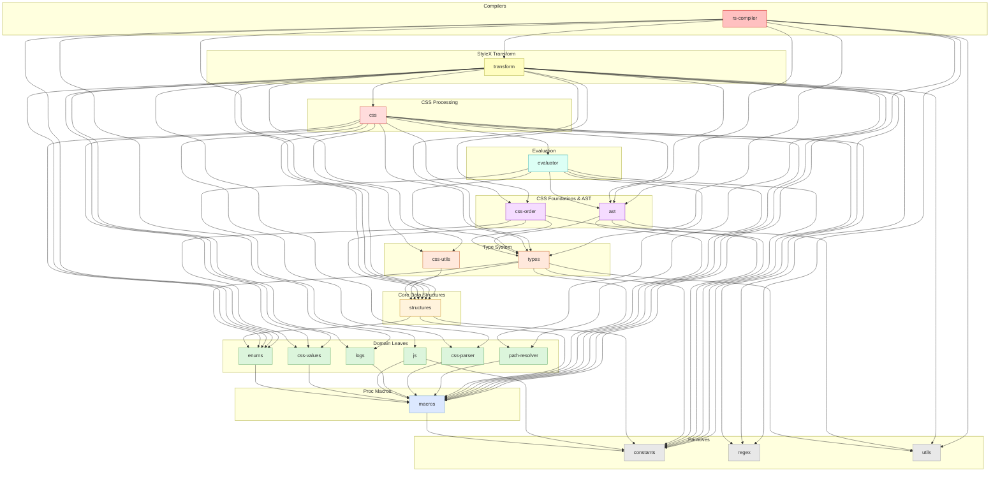

# `stylex-ast`

> Part of the [StyleX SWC Plugin](https://github.com/Dwlad90/stylex-swc-plugin#readme) workspace

## Overview

SWC AST manipulation utilities — factory functions for creating AST nodes
and pure convertor functions for extracting and coercing values. This crate
was split out so that any layer needing to construct or inspect SWC `Expr` /
`Lit` / `Ident` nodes can do so without pulling in the full transform or CSS
pipelines. All 54+ public functions follow a strict semantic naming
convention (`create_*`, `convert_*`, `extract_*`, `coerce_*`) that makes
intent immediately clear at the call site.

- **Factories** — ~36 `create_*` functions that construct AST nodes from
  primitive values (literals, identifiers, properties, expressions, JSX
  attributes, variable declarators)
- **Convertors** — ~20 `convert_*` / `extract_*` / `expand_*` functions
  that transform between AST types, extract inner values, and expand
  shorthand properties
- **Type-specific suffixes** — `_lit`, `_expr`, `_prop`, `_or_spread`
  encode the output SWC type directly in the function name
- **Error strategy** — `Result<T>` for fallible conversions,
  `Option<T>` for nullable extractions, `stylex_panic!` for invariant
  violations

## Architecture

- **Layer**: 5 — CSS Foundations & AST
- **Depends on**:
  [`stylex-constants`](https://github.com/Dwlad90/stylex-swc-plugin/tree/develop/crates/stylex-constants),
  [`stylex-macros`](https://github.com/Dwlad90/stylex-swc-plugin/tree/develop/crates/stylex-macros),
  [`stylex-types`](https://github.com/Dwlad90/stylex-swc-plugin/tree/develop/crates/stylex-types),
  [`stylex-utils`](https://github.com/Dwlad90/stylex-swc-plugin/tree/develop/crates/stylex-utils)
- **Depended on by**:
  [`stylex-css`](https://github.com/Dwlad90/stylex-swc-plugin/tree/develop/crates/stylex-css),
  [`stylex-evaluator`](https://github.com/Dwlad90/stylex-swc-plugin/tree/develop/crates/stylex-evaluator),
  [`stylex-rs-compiler`](https://github.com/Dwlad90/stylex-swc-plugin/tree/develop/crates/stylex-rs-compiler),
  [`stylex-transform`](https://github.com/Dwlad90/stylex-swc-plugin/tree/develop/crates/stylex-transform)

### Key Exports — Factories (`ast::factories`)

| Function | Output | Purpose |
|----------|--------|---------|
| `create_string_lit` | `Lit` | String literal |
| `create_number_lit` | `Lit` | Numeric literal |
| `create_big_int_lit` | `Lit` | BigInt literal |
| `create_boolean_lit` | `Lit` | Boolean literal |
| `create_null_lit` | `Lit` | Null literal |
| `create_ident` | `Ident` | Identifier node |
| `create_object_lit` / `create_object_expression` | `ObjectLit` / `Expr` | Object literal / expression |
| `create_array_lit` / `create_array_expression` | `ArrayLit` / `Expr` | Array literal / expression |
| `create_key_value_prop` | `PropOrSpread` | `key: value` property |
| `create_nested_object_prop` | `PropOrSpread` | Nested object property |
| `create_prop_from_name` | `PropOrSpread` | Property from `PropName` |
| `create_ident_key_value_prop` | `PropOrSpread` | Identifier-keyed property |
| `create_string_key_value_prop` | `PropOrSpread` | String-valued property |
| `create_string_array_prop` | `PropOrSpread` | String-array property |
| `create_boolean_prop` | `PropOrSpread` | Boolean property |
| `create_binding_ident` | `BindingIdent` | Binding identifier |
| `create_expr_or_spread` | `ExprOrSpread` | Expression or spread element |
| `create_spread_element` / `create_spread_prop` | `SpreadElement` / `PropOrSpread` | Spread elements |
| `create_member_call_expr` | `CallExpr` | Member call expression |
| `create_ident_call_expr` | `CallExpr` | Identifier call expression |
| `create_arrow_expression` | `Expr` | Arrow function expression |
| `create_jsx_attr` / `create_jsx_spread_attr` | `JSXAttr` / `JSXAttrOrSpread` | JSX attribute / spread |
| `create_var_declarator` / `create_null_var_declarator` | `VarDeclarator` | Variable declarators |
| `wrap_in_paren` / `wrap_in_paren_ref` | `Expr` | Parenthesised expression |

### Key Exports — Convertors (`ast::convertors`)

| Function | Output | Purpose |
|----------|--------|---------|
| `convert_lit_to_number` | `Result<f64>` | Extract numeric value from literal |
| `convert_lit_to_string` | `Option<String>` | Extract string value from literal |
| `convert_tpl_to_string_lit` | `Option<Lit>` | Template literal → string literal |
| `convert_simple_tpl_to_str_expr` | `Expr` | Simple template → string expression |
| `convert_concat_to_tpl_expr` | `Expr` | Concatenation → template expression |
| `convert_string_to_prop_name` | `Option<PropName>` | String → property name |
| `convert_atom_to_string` | `String` | SWC Atom → String |
| `convert_wtf8_to_atom` | `Atom` | WTF-8 → Atom conversion |
| `convert_str_lit_to_string` / `_to_atom` | `String` / `Atom` | String literal extraction |
| `extract_tpl_cooked_value` | `String` | Template element cooked value |
| `extract_str_lit_ref` | `Option<&str>` | Zero-copy string literal ref |
| `expand_shorthand_prop` | `()` | `{foo}` → `{foo: foo}` expansion |

### Modules

| Module | Description |
|--------|-------------|
| `ast::factories` | ~36 `create_*` functions for constructing SWC AST nodes |
| `ast::convertors` | ~20 `convert_*` / `extract_*` / `expand_*` functions for AST transformation |

## Dependency Graph

<details>
<summary><h3>Dependency Graph</h3></summary>



</details>

---

## Development

```bash
make crate-ast-build    # Build the crate
make crate-ast-lint     # Lint with Clippy
make crate-ast-docs     # Generate rustdoc
```

## License

MIT — see [LICENSE](https://github.com/Dwlad90/stylex-swc-plugin/blob/develop/LICENSE)
