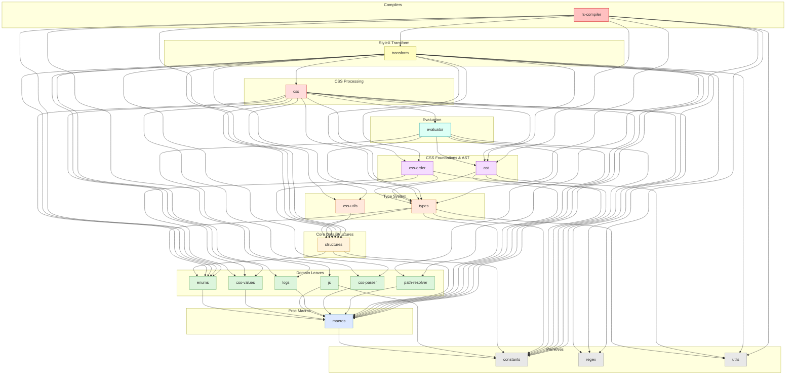

# `stylex-css-order`

> Part of the [StyleX SWC Plugin](https://github.com/Dwlad90/stylex-swc-plugin#readme) workspace

## Overview

Deterministic CSS property ordering and specificity ranking for StyleX. This
crate encapsulates three ordering strategies — `ApplicationOrder`,
`LegacyExpandShorthandsOrder`, and `PropertySpecificityOrder` — together
with their associated constant tables of shorthand expansions and alias
mappings. It was extracted so ordering logic can evolve independently of CSS
generation and transform passes.

- **Three strategies, one trait** — each strategy is a zero-sized struct
  implementing the `Order` trait from `stylex-structures`, providing a
  single `get_expansion_fn(property)` entry point
- **Shorthand expansion** — `Shorthands` structs map CSS shorthand
  properties (e.g. `border`, `flex`, `grid`) to their longhand
  equivalents, returning `Vec<OrderPair>`
- **Alias resolution** — `Aliases` structs map deprecated or alternate
  property names to their canonical forms before expansion
- **Graduated strictness** — `ApplicationOrder` supports 120+ properties,
  `LegacyExpandShorthandsOrder` is moderate (~40), and
  `PropertySpecificityOrder` is the most restrictive (~30)

## Architecture

- **Layer**: 5 — CSS Foundations & AST
- **Depends on**:
  [`stylex-constants`](https://github.com/Dwlad90/stylex-swc-plugin/tree/develop/crates/stylex-constants),
  [`stylex-css-values`](https://github.com/Dwlad90/stylex-swc-plugin/tree/develop/crates/stylex-css-values),
  [`stylex-structures`](https://github.com/Dwlad90/stylex-swc-plugin/tree/develop/crates/stylex-structures),
  [`stylex-types`](https://github.com/Dwlad90/stylex-swc-plugin/tree/develop/crates/stylex-types)
- **Depended on by**:
  [`stylex-css`](https://github.com/Dwlad90/stylex-swc-plugin/tree/develop/crates/stylex-css),
  [`stylex-transform`](https://github.com/Dwlad90/stylex-swc-plugin/tree/develop/crates/stylex-transform)

### Key Exports

| Export | Kind | Purpose |
|--------|------|---------|
| `ApplicationOrder` | struct | Broadest expansion strategy (~120+ CSS properties) |
| `LegacyExpandShorthandsOrder` | struct | Moderate expansion with backward-compatible rules (~40 properties) |
| `PropertySpecificityOrder` | struct | Most restrictive expansion for specificity calculations (~30 properties) |

All three implement the `Order` trait:

```rust
pub trait Order {
  fn get_expansion_fn(property: &str)
    -> Option<fn(Option<String>) -> Result<Vec<OrderPair>, String>>;
}
```

Each struct's `get_expansion_fn` first checks `Aliases::get()`, then
falls back to `Shorthands::get()` from its corresponding constants
module.

### Modules

| Module | Description |
|--------|-------------|
| `constants::application_order` | `Shorthands` (~148 fns) and `Aliases` for full property expansion |
| `constants::legacy_expand_shorthands_order` | `Shorthands` (~83 fns) and `Aliases` for legacy-compatible expansion |
| `constants::property_specificity_order` | `Shorthands` (~62 fns) and `Aliases` for specificity-based expansion |
| `structures::application_order` | `ApplicationOrder` struct implementing `Order` |
| `structures::legacy_expand_shorthands_order` | `LegacyExpandShorthandsOrder` struct implementing `Order` |
| `structures::property_specificity_order` | `PropertySpecificityOrder` struct implementing `Order` |

### Strategy Comparison

| Strategy | Scope | Behaviour |
|----------|-------|-----------|
| **ApplicationOrder** | General-purpose | Expands most shorthands into all longhand components |
| **LegacyExpandShorthandsOrder** | Backward-compat | Limited expansion; many properties return errors |
| **PropertySpecificityOrder** | Specificity | Minimal expansion focused on logical / writing-mode properties |

## Dependency Graph

<details>
<summary><h3>Dependency Graph</h3></summary>



</details>

---

## Development

```bash
make crate-css-order-build    # Build the crate
make crate-css-order-lint     # Lint with Clippy
make crate-css-order-docs     # Generate rustdoc
```

## License

MIT — see [LICENSE](https://github.com/Dwlad90/stylex-swc-plugin/blob/develop/LICENSE)
