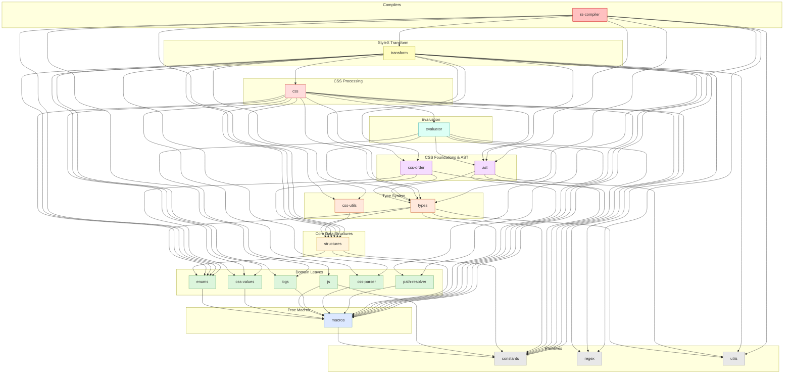

# `stylex-css-parser`

> Part of the [StyleX SWC Plugin](https://github.com/Dwlad90/stylex-swc-plugin#readme) workspace

## Overview

A high-performance CSS value parser (~28 k lines) providing comprehensive
parsing and validation for CSS properties, types, and at-rules. This was
already an independent crate before the monorepo refactor; it is now a
clean leaf with no internal dependencies beyond `stylex-macros`.

- Full CSS type coverage: colors, lengths, angles, calc expressions,
  transform functions, easing, filters, and more
- Flexible parser combinator system (`FlexParser`, `FlexCombinators`)
  with backtracking support for composable, zero-copy parsing
- Media query parsing and transformation with "last media query wins"
  semantics via `last_media_query_wins_transform`

## Architecture

- **Layer**: 2 — Domain Leaves
- **Depends on**: `stylex-macros`
- **Depended on by**: `stylex-css`, `stylex-transform`

### Key Exports

- `CssValue` — parsed CSS value representation
- `FlexParser` / `FlexCombinators` — composable parser combinators
- `CssParseError` / `CssResult` — error and result types
- `last_media_query_wins_transform` — media query deduplication

### Modules

| Module | Purpose |
| --- | --- |
| `at_queries` | Media and feature query parsing and transformation |
| `base_types` | Foundational parser types and traits |
| `css_types` | Type-specific parsers (colors, lengths, angles, calc, transforms, easing, filters) |
| `css_value` | `CssValue` enum and conversion logic |
| `flex_parser` | `FlexParser` and `FlexCombinators` combinator system |
| `properties` | Property-level parsers (transform, box-shadow, border-radius) |
| `token_parser` | Token-stream parsing utilities |
| `token_types` | Token classification and matching |
| `tests` | 480+ tests covering all parsing paths |

## Dependency Graph

<details>
<summary><h3>Dependency Graph</h3></summary>



</details>

## Development

```bash
make crate-parser-build    # Build CSS parser crate
make crate-parser-format   # Format CSS parser crate
make crate-parser-lint     # Lint CSS parser crate
make crate-parser-clean    # Clean CSS parser crate
make crate-parser-docs     # Generate docs for CSS parser crate
```

## License

MIT — see [LICENSE](https://github.com/Dwlad90/stylex-swc-plugin/blob/develop/LICENSE)
