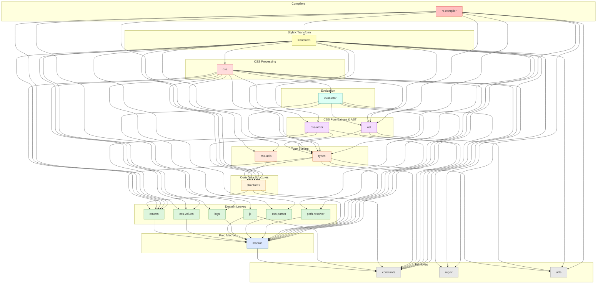

# `stylex-css`

> Part of the [StyleX SWC Plugin](https://github.com/Dwlad90/stylex-swc-plugin#readme) workspace

## Overview

Pure CSS generation and normalization crate for the StyleX compiler pipeline.
This crate was extracted from the former `stylex-shared` monolith to
encapsulate all CSS output logic — LTR and RTL generation plus whitespace
normalization — in a single, stateless package that does **not** depend on
per-file compiler state (`StateManager`). By keeping CSS generation isolated,
the crate can be tested, profiled, and reasoned about independently from the
rest of the transform layer.

- **Stateless CSS generation** — produces CSS strings from StyleX declarations
  without requiring a `StateManager`, making every function a pure
  input → output transform.
- **Bidirectional (LTR / RTL) output** — dedicated modules generate
  left-to-right and right-to-left stylesheets, enabling automatic
  bidirectional support in downstream consumers.
- **Whitespace normalization** — a normalizer pass canonicalises whitespace in
  generated CSS so that output is deterministic and diff-friendly.
- **Orchestrates all CSS sub-crates** — pulls together
  [`stylex-css-order`](https://github.com/Dwlad90/stylex-swc-plugin/tree/develop/crates/stylex-css-order),
  [`stylex-css-parser`](https://github.com/Dwlad90/stylex-swc-plugin/tree/develop/crates/stylex-css-parser),
  [`stylex-css-utils`](https://github.com/Dwlad90/stylex-swc-plugin/tree/develop/crates/stylex-css-utils),
  and
  [`stylex-css-values`](https://github.com/Dwlad90/stylex-swc-plugin/tree/develop/crates/stylex-css-values)
  into a unified CSS processing layer.
- **Deterministic output** — given the same input declarations and
  configuration, the crate always produces byte-identical CSS, which
  simplifies snapshot testing and caching.

## Architecture

- **Layer**: 7 — CSS Processing
- **Depends on**:
  [`stylex-ast`](https://github.com/Dwlad90/stylex-swc-plugin/tree/develop/crates/stylex-ast),
  [`stylex-constants`](https://github.com/Dwlad90/stylex-swc-plugin/tree/develop/crates/stylex-constants),
  [`stylex-css-order`](https://github.com/Dwlad90/stylex-swc-plugin/tree/develop/crates/stylex-css-order),
  [`stylex-css-parser`](https://github.com/Dwlad90/stylex-swc-plugin/tree/develop/crates/stylex-css-parser),
  [`stylex-css-utils`](https://github.com/Dwlad90/stylex-swc-plugin/tree/develop/crates/stylex-css-utils),
  [`stylex-css-values`](https://github.com/Dwlad90/stylex-swc-plugin/tree/develop/crates/stylex-css-values),
  [`stylex-enums`](https://github.com/Dwlad90/stylex-swc-plugin/tree/develop/crates/stylex-enums),
  [`stylex-evaluator`](https://github.com/Dwlad90/stylex-swc-plugin/tree/develop/crates/stylex-evaluator),
  [`stylex-macros`](https://github.com/Dwlad90/stylex-swc-plugin/tree/develop/crates/stylex-macros),
  [`stylex-regex`](https://github.com/Dwlad90/stylex-swc-plugin/tree/develop/crates/stylex-regex),
  [`stylex-structures`](https://github.com/Dwlad90/stylex-swc-plugin/tree/develop/crates/stylex-structures),
  [`stylex-types`](https://github.com/Dwlad90/stylex-swc-plugin/tree/develop/crates/stylex-types)
- **Depended on by**:
  [`stylex-transform`](https://github.com/Dwlad90/stylex-swc-plugin/tree/develop/crates/stylex-transform)

### Key Exports / Public API

| Export | Description |
| --- | --- |
| `css::generate_ltr` | Generates LTR CSS rules from StyleX declarations |
| `css::generate_rtl` | Generates RTL CSS rules for bidirectional style support |
| `css::normalizers::whitespace_normalizer` | Canonicalises whitespace in CSS output |

### Modules

- **`css::generate_ltr`** — LTR CSS generation from StyleX declarations.
  Accepts resolved style values and produces left-to-right CSS rule strings.
- **`css::generate_rtl`** — RTL CSS generation for bidirectional style
  support. Mirrors logical properties and values so that a single set of
  declarations can serve both writing directions.
- **`css::normalizers::whitespace_normalizer`** — CSS whitespace
  normalization. Collapses and trims whitespace so that generated CSS is
  compact and deterministic regardless of formatting upstream.

## Dependency Graph

<details>
<summary><h3>Dependency Graph</h3></summary>



</details>

## Development

```bash
# Build
make crate-css-build

# Lint
make crate-css-lint

# Generate docs
make crate-css-docs
```

## License

MIT — see [LICENSE](https://github.com/Dwlad90/stylex-swc-plugin/blob/develop/LICENSE)
