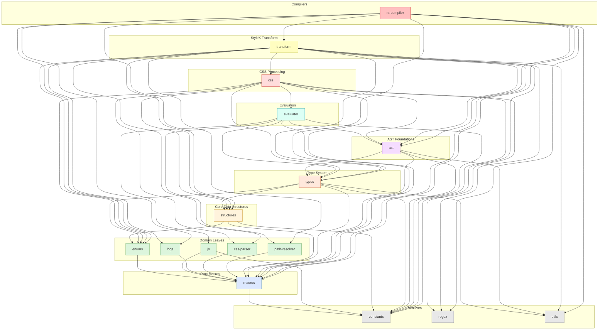

# `stylex-css`

> Part of the
> [StyleX SWC Plugin](https://github.com/Dwlad90/stylex-swc-plugin#readme)
> workspace

## Overview

Unified CSS processing crate for the StyleX compiler pipeline. This crate
consolidates all CSS-related functionality — generation, value parsing, property
ordering, and utility helpers — into a single, cohesive package. It was formed
by merging the former `stylex-css-utils`, `stylex-css-values`, and
`stylex-css-order` crates into submodules, reducing workspace complexity and
eliminating cross-crate boundaries for tightly coupled CSS logic.

- **Stateless CSS generation** — produces CSS strings from StyleX declarations
  without requiring a `StateManager`, making every function a pure input →
  output transform.
- **Bidirectional (LTR / RTL) output** — dedicated modules generate
  left-to-right and right-to-left stylesheets, enabling automatic bidirectional
  support in downstream consumers.
- **CSS value parsing** — tokenises and parses CSS value strings using the
  `cssparser` crate, splitting shorthand properties into their individual
  components (top, right, bottom, left).
- **Property ordering strategies** — implements three ordering strategies
  (`ApplicationOrder`, `LegacyExpandShorthandsOrder`,
  `PropertySpecificityOrder`) for deterministic shorthand expansion and CSS
  property sorting.
- **Pseudo-class and selector utilities** — provides `when::ancestor`,
  `when::descendant`, `when::sibling_*` and other helpers for generating
  conditional CSS selectors from StyleX state options.
- **Whitespace normalization** — canonicalises whitespace in generated CSS so
  output is deterministic and diff-friendly.
- **Deterministic output** — given identical input declarations and
  configuration, the crate always produces byte-identical CSS, which simplifies
  snapshot testing and caching.

## Architecture

- **Layer**: 7 — CSS Processing
- **Depends on**:
  [`stylex-ast`](https://github.com/Dwlad90/stylex-swc-plugin/tree/develop/crates/stylex-ast),
  [`stylex-constants`](https://github.com/Dwlad90/stylex-swc-plugin/tree/develop/crates/stylex-constants),
  [`stylex-css-parser`](https://github.com/Dwlad90/stylex-swc-plugin/tree/develop/crates/stylex-css-parser),
  [`stylex-enums`](https://github.com/Dwlad90/stylex-swc-plugin/tree/develop/crates/stylex-enums),
  [`stylex-evaluator`](https://github.com/Dwlad90/stylex-swc-plugin/tree/develop/crates/stylex-evaluator),
  [`stylex-macros`](https://github.com/Dwlad90/stylex-swc-plugin/tree/develop/crates/stylex-macros),
  [`stylex-regex`](https://github.com/Dwlad90/stylex-swc-plugin/tree/develop/crates/stylex-regex),
  [`stylex-structures`](https://github.com/Dwlad90/stylex-swc-plugin/tree/develop/crates/stylex-structures),
  [`stylex-types`](https://github.com/Dwlad90/stylex-swc-plugin/tree/develop/crates/stylex-types)
- **Depended on by**:
  [`stylex-transform`](https://github.com/Dwlad90/stylex-swc-plugin/tree/develop/crates/stylex-transform)

## Dependency Graph

<h3>Dependency Graph</h3>

## License

MIT — see
[LICENSE](https://github.com/Dwlad90/stylex-swc-plugin/blob/develop/LICENSE)
