# `stylex-diagnostics`

> Part of the
> [StyleX SWC Plugin](https://github.com/Dwlad90/stylex-swc-plugin#readme)
> workspace

## Overview

How StyleX shows an author _where_ a refusal happened. A code frame quotes the
offending line back out of the file the author wrote, which means finding that
line again: what the compiler holds by then is a rewritten tree whose positions
belong to its own source map, not to the text on disk.

- **Code frame** — `CodeFrame`, the quoted line with a caret under the offending
  text, built against a process-wide source map of its own. One entry is
  registered per distinct file _content_, so a watch-mode process does not
  accumulate a copy of each module per save.
- **Expression lookup** — `get_span_from_source_code` finds the position of a
  compiled expression by matching it, structurally, against the module's own
  re-parsed source.
- **Namespace key lookup** — `get_key_span_from_source_code` finds a style
  namespace by its _key_ instead, which survives value-level rewrites an earlier
  loader may have made.
- **Declaration lookup** — a refusal about a binding is framed at that binding's
  declaration, which is the line the author has to go and change.

## Architecture

Everything here is best effort. Every lookup sits behind a panic boundary and
degrades to "no code frame", because a compilation must never stop on account of
the aid that explains why it stopped. The process panic hook is replaced once, so
a panic raised inside a boundary is silent while every other panic still reaches
the hook that was there before.

What a diagnostic needs from the compiler's traversal state is declared here as
the `DiagnosticState` trait and implemented by the caller — the same injection
`stylex-atoms` uses — so that building a frame never names the state manager,
which would make the transform and the diagnostics depend on each other. The
trait is consulted while a diagnostic is being written, never while a module is
being evaluated.

A refused binding is recorded by **name**, not by position: a span from the
compiler's parse indexes the compiler's source map, while the frame's positions
live in the one it built for the file. The name is resolved against the module
the frame re-parsed, and a name that module does not declare falls back to
locating the read.

- **Layer**: 7 — Diagnostics
- **Depends on**: `swc_core`, `swc_compiler_base`, `anyhow`, `log`,
  [`stylex-ast`](https://github.com/Dwlad90/stylex-swc-plugin/tree/develop/crates/stylex-ast)
  for reading expressions back,
  [`stylex-macros`](https://github.com/Dwlad90/stylex-swc-plugin/tree/develop/crates/stylex-macros)
  for the error a refusal panics with,
  [`stylex-regex`](https://github.com/Dwlad90/stylex-swc-plugin/tree/develop/crates/stylex-regex)
  for the links a message carries,
  [`stylex-state-index`](https://github.com/Dwlad90/stylex-swc-plugin/tree/develop/crates/stylex-state-index)
  for the key span index, and
  [`stylex-utils`](https://github.com/Dwlad90/stylex-swc-plugin/tree/develop/crates/stylex-utils)
  for the stable hash the span cache is keyed by
- **Depended on by**:
  [`stylex-transform`](https://github.com/Dwlad90/stylex-swc-plugin/tree/develop/crates/stylex-transform),
  whose state manager implements `DiagnosticState`

## Dependency Graph

```mermaid
graph TD
  subgraph L0["Primitives"]
    stylex_constants["constants"]
    stylex_regex["regex"]
    stylex_styleq["styleq"]
    stylex_utils["utils"]
  end

  subgraph L1["Proc Macros"]
    stylex_macros["macros"]
  end

  subgraph L2["Domain Leaves"]
    stylex_enums["enums"]
    stylex_js["js"]
    stylex_logs["logs"]
    stylex_css_parser["css-parser"]
    stylex_path_resolver["path-resolver"]
  end

  subgraph L3["Core Data Structures"]
    stylex_structures["structures"]
  end

  subgraph L4["Type System"]
    stylex_types["types"]
  end

  subgraph L5["AST Foundations"]
    stylex_ast["ast"]
  end

  subgraph L6["State Lookup"]
    stylex_state_index["state-index"]
  end

  subgraph L7["Diagnostics"]
    stylex_diagnostics["diagnostics"]
  end

  subgraph L8["Nested Config"]
    stylex_nested_config["nested-config"]
  end

  subgraph L9["CSS Processing"]
    stylex_css["css"]
  end

  subgraph L10["StyleX Transform"]
    stylex_transform["transform"]
  end

  subgraph L11["Compilers"]
    stylex_compiler_rs["rs-compiler"]
  end

  stylex_utils         --> stylex_regex

  stylex_macros        --> stylex_constants

  stylex_enums         --> stylex_macros
  stylex_js            --> stylex_constants
  stylex_js            --> stylex_macros
  stylex_logs          --> stylex_macros
  stylex_css_parser    --> stylex_macros
  stylex_path_resolver --> stylex_macros

  stylex_structures    --> stylex_constants
  stylex_structures    --> stylex_enums
  stylex_structures    --> stylex_macros

  stylex_types         --> stylex_constants
  stylex_types         --> stylex_enums
  stylex_types         --> stylex_macros
  stylex_types         --> stylex_structures
  stylex_types         --> stylex_utils

  stylex_ast           --> stylex_constants
  stylex_ast           --> stylex_macros
  stylex_ast           --> stylex_types
  stylex_ast           --> stylex_utils

  stylex_state_index   --> stylex_ast
  stylex_state_index   --> stylex_utils

  stylex_diagnostics   --> stylex_ast
  stylex_diagnostics   --> stylex_macros
  stylex_diagnostics   --> stylex_regex
  stylex_diagnostics   --> stylex_state_index
  stylex_diagnostics   --> stylex_utils

  stylex_nested_config --> stylex_ast
  stylex_nested_config --> stylex_constants
  stylex_nested_config --> stylex_js
  stylex_nested_config --> stylex_macros
  stylex_nested_config --> stylex_path_resolver
  stylex_nested_config --> stylex_types

  stylex_css           --> stylex_ast
  stylex_css           --> stylex_constants
  stylex_css           --> stylex_css_parser
  stylex_css           --> stylex_enums
  stylex_css           --> stylex_nested_config
  stylex_css           --> stylex_macros
  stylex_css           --> stylex_regex
  stylex_css           --> stylex_structures
  stylex_css           --> stylex_types
  stylex_css           --> stylex_utils

  stylex_transform     --> stylex_ast
  stylex_transform     --> stylex_constants
  stylex_transform     --> stylex_css
  stylex_transform     --> stylex_css_parser
  stylex_transform     --> stylex_diagnostics
  stylex_transform     --> stylex_enums
  stylex_transform     --> stylex_nested_config
  stylex_transform     --> stylex_logs
  stylex_transform     --> stylex_macros
  stylex_transform     --> stylex_path_resolver
  stylex_transform     --> stylex_regex
  stylex_transform     --> stylex_state_index
  stylex_transform     --> stylex_structures
  stylex_transform     --> stylex_styleq
  stylex_transform     --> stylex_types
  stylex_transform     --> stylex_utils

  stylex_compiler_rs   --> stylex_ast
  stylex_compiler_rs   --> stylex_enums
  stylex_compiler_rs   --> stylex_logs
  stylex_compiler_rs   --> stylex_macros
  stylex_compiler_rs   --> stylex_regex
  stylex_compiler_rs   --> stylex_structures
  stylex_compiler_rs   --> stylex_transform
  stylex_compiler_rs   --> stylex_types
  stylex_compiler_rs   --> stylex_utils

  classDef l0 fill:#e8e8e8,stroke:#999,color:#333
  classDef l1 fill:#dce8ff,stroke:#6699cc,color:#333
  classDef l2 fill:#dcf5dc,stroke:#66aa66,color:#333
  classDef l3 fill:#fff3dc,stroke:#cc9933,color:#333
  classDef l4 fill:#ffe8dc,stroke:#cc6633,color:#333
  classDef l5 fill:#f5dcff,stroke:#9933cc,color:#333
  classDef l6 fill:#dcecff,stroke:#3388cc,color:#333
  classDef l7 fill:#f0e6ff,stroke:#8866cc,color:#333
  classDef l8 fill:#dcfff5,stroke:#33aaaa,color:#333
  classDef l9 fill:#ffdcdc,stroke:#cc3333,color:#333
  classDef l10 fill:#fffdc0,stroke:#aaaa33,color:#333
  classDef l11 fill:#ffc0c0,stroke:#cc0000,color:#333

  class stylex_constants,stylex_regex,stylex_styleq,stylex_utils l0
  class stylex_macros l1
  class stylex_enums,stylex_js,stylex_logs,stylex_css_parser,stylex_path_resolver l2
  class stylex_structures l3
  class stylex_types l4
  class stylex_ast l5
  class stylex_state_index l6
  class stylex_diagnostics l7
  class stylex_nested_config l8
  class stylex_css l9
  class stylex_transform l10
  class stylex_compiler_rs l11
```

<h3>Dependency Graph</h3>

---

## License

MIT — see
[LICENSE](https://github.com/Dwlad90/stylex-swc-plugin/blob/develop/LICENSE)
