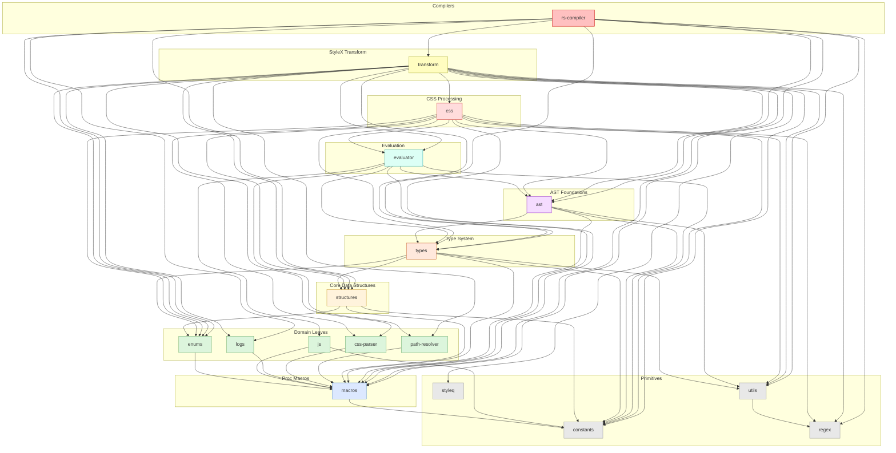

# `stylex-js`

> Part of the
> [StyleX SWC Plugin](https://github.com/Dwlad90/stylex-swc-plugin#readme)
> workspace

## Overview

JavaScript runtime guard functions used during compile-time evaluation of JS
expressions. Extracted into its own crate so the evaluator can depend on a
focused set of AST-inspection helpers without pulling in the full transformation
pipeline.

- Provides compile-time guards such as `is_valid_callee`, `is_mutation_expr`,
  and `is_invalid_method` for safe AST evaluation
- Ensures the evaluator only processes side-effect-free JavaScript expressions
- Thin leaf crate with no transitive dependencies beyond primitives and macros

## Architecture

- **Layer**: 2 — Domain Leaves
- **Depends on**: `stylex-constants`, `stylex-macros`
- **Depended on by**: `stylex-evaluator`

### Modules

| Module    | Purpose                                                                              |
| --------- | ------------------------------------------------------------------------------------ |
| `helpers` | JS runtime guards (`is_valid_callee`, `is_mutation_expr`, `is_invalid_method`, etc.) |

## Dependency Graph

<h3>Dependency Graph</h3>

## License

MIT — see
[LICENSE](https://github.com/Dwlad90/stylex-swc-plugin/blob/develop/LICENSE)
