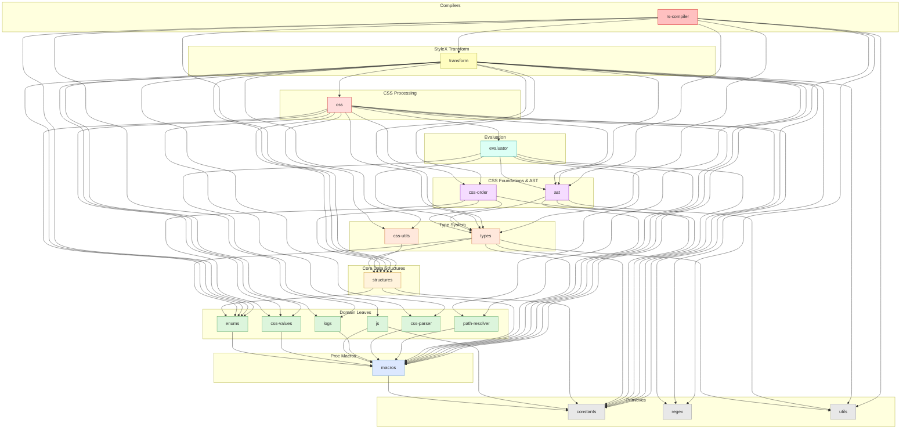

# NAPI-RS compiler for StyleX (\*\*unofficial)

> Part of the [StyleX SWC Plugin](https://github.com/Dwlad90/stylex-swc-plugin#readme) workspace

StyleX is a JavaScript library developed by Meta for defining styles optimized
for user interfaces. You can find the [official StyleX repository](https://www.github.com/facebook/stylex) here.

> [!WARNING] This is an unofficial style compiler for StyleX.

## Overview

This package provides an unofficial, high-performance NAPI-RS compiler for
StyleX, a popular library from Meta for building optimized user interfaces.
It is the top-level consumer crate that exposes the full StyleX pipeline to
Node.js, leveraging SWC for parsing and transformation.

> [!IMPORTANT] The usage of StyleX does not change. All changes are internal.

- Faster Build Times: By utilizing SWC instead of Babel, you can potentially
  experience significant speed improvements during StyleX processing.
- Seamless Integration: This compiler seamlessly integrates with Next.js's
  default SWC Compiler, ensuring a smooth workflow.
- Drop-in Replacement: Designed to be a drop-in replacement for the official
  StyleX Babel plugin, minimizing disruption to existing codebases.
- Advanced Tooling Capabilities: NAPI-RS compiler unlocks access to StyleX
  metadata and source maps, enabling the creation of advanced plugins and tools
  for StyleX, ex. for creating a plugin for Webpack, Rollup, or other tools.

## Advantages of a `NAPI-RS` compiler versus a `SWC plugin`

- Compability with SWC: under the hood, the NAPI-RS compiler uses SWC for
  parsing and transforming JavaScript code, ensuring compatibility with the
  latest ECMAScript features.
- Direct Access to Node.js APIs: NAPI-RS allows you to directly access Node.js
  APIs from your Rust code, providing greater flexibility and control.
- Improved Performance: NAPI-RS can often offer better performance than
  traditional Node.js addons, especially for computationally intensive tasks.
- Simplified Development: NAPI-RS simplifies the process of developing Node.js
  addons in Rust, making it easier to create high-performance and efficient
  tools.

## Architecture

- **Layer**: 9 — Compilers (top-level consumer)
- **Depends on**: `stylex-ast`, `stylex-enums`, `stylex-logs`,
  `stylex-macros`, `stylex-regex`, `stylex-structures`,
  `stylex-transform`, `stylex-types`, `stylex-utils`
- **Depended on by**: None (top-level entry point)

### Public API

- `transform()` — Main entry point: takes source code + options, returns
  transformed output
- `should_transform_file()` — File filtering based on path patterns
- `normalize_rs_options()` — Options normalization and validation

### Modules

- `enums` — Compiler-specific enum types
- `structs` — Compiler-specific struct types
- `utils::fn_parser` — Function argument parsing
- `utils::metadata` — Build metadata handling
- `utils::path_filter` — File path filtering logic

## Dependency Graph

<details>
<summary><h3>Dependency Graph</h3></summary>



</details>

## Installation

To install the package, run the following command:

```bash
npm install --save-dev @stylexswc/rs-compiler
```

### Transformation Process

Internally, this compiler takes your StyleX code and transforms it into a format
optimized for further processing.

```ts
var { transform } = require('@stylexswc/rs-compiler');

/// ...other logic

const { code, metadata, sourcemap } = transform(
  filename,
  inputSourceCode,
  transformOptions
);

/// ...other logic
```

### Path Filtering

> [!NOTE] **New Feature:** The `include` and `exclude` options are exclusive to
> this NAPI-RS compiler implementation and are not available in the official
> StyleX Babel plugin. They provide powerful file filtering capabilities to
> control which files are transformed.

The compiler exports a `shouldTransformFile` function to determine whether a
file should be transformed based on include/exclude patterns:

```ts
import { shouldTransformFile } from '@stylexswc/rs-compiler';

const shouldTransform = shouldTransformFile(
  '/path/to/file.tsx',
  ['src/**/*.{ts,tsx}'], // include patterns (optional)
  ['**/*.test.*', '**/__tests__/**'] // exclude patterns (optional)
);

if (shouldTransform) {
  // Transform the file
}
```

#### Pattern Types

- **Glob patterns** (strings): Use standard glob syntax to match file paths
  - `src/**/*.tsx` - All `.tsx` files in `src` directory and subdirectories
  - `**/*.test.*` - All test files
  - `**/node_modules/**` - All files in `node_modules`

- **Regular expressions**: Use RegExp objects for complex pattern matching
  - `/\.test\./` - Files containing `.test.`
  - `/^src\/.*\.tsx$/` - `.tsx` files directly in the `src` directory

  **Advanced: Lookahead/Lookbehind Support**

  The Rust regex engine fully supports lookahead and lookbehind assertions,
  enabling sophisticated filtering patterns:
  - **Negative Lookahead** `(?!...)`: Match if NOT followed by pattern
    - `/node_modules(?!\/@stylexjs)/` - Exclude all node_modules except
      @stylexjs packages
    - `/\.tsx(?!\.test)/` - Match .tsx files that are NOT test files

  - **Positive Lookahead** `(?=...)`: Match if followed by pattern
    - `/.*\.test(?=\.tsx$)/` - Match only .test.tsx files

  - **Negative Lookbehind** `(?<!...)`: Match if NOT preceded by pattern
    - `/(?<!src\/).*\.tsx$/` - Exclude .tsx files not in src/

  - **Positive Lookbehind** `(?<=...)`: Match if preceded by pattern
    - `/(?<=components\/).*\.tsx$/` - Match only .tsx files in components/

#### Filtering Rules

1. If `include` patterns are specified and not empty, files must match at least
   one pattern
2. If `exclude` patterns are specified, files matching any pattern are excluded
3. Exclude patterns take precedence over include patterns
4. All paths are matched relative to the current working directory

#### Common Use Cases

**Exclude all node_modules except specific packages:**

```ts
// Exclude all node_modules except @stylexjs/open-props
shouldTransformFile(filePath, undefined, [
  /node_modules(?!\/@stylexjs\/open-props)/,
]);
```

**Transform only specific packages from node_modules:**

```ts
shouldTransformFile(
  filePath,
  [
    'src/**/*.{ts,tsx}',
    'node_modules/@stylexjs/open-props/**/*.js',
    'node_modules/@my-org/design-system/**/*.js',
  ],
  ['**/*.test.*']
);
```

**Exclude multiple node_modules packages except a few:**

```ts
// Exclude all node_modules except @stylexjs packages
shouldTransformFile(filePath, undefined, [/node_modules(?!\/@stylexjs)/]);
```

### SWC Plugin Support

> [!NOTE] **New Feature:** The compiler now supports running SWC WASM plugins
> before StyleX transformation. This allows you to chain transformations and
> integrate custom SWC plugins seamlessly.

The `transform` function accepts an optional `swcPlugins` array in the options
object, allowing you to run SWC WASM plugins before the StyleX transformation:

```ts
const { transform } = require('@stylexswc/rs-compiler');

const { code, metadata, map } = transform('Button.tsx', sourceCode, {
  dev: true,
  // Other StyleX options...

  // SWC plugins to run before StyleX transformation
  swcPlugins: [
    // Plugin as [pluginPath, config]
    [
      '/path/to/swc_plugin_theme.wasm',
      {
        themeName: 'my-theme',
        customOption: 'value',
      },
    ],
    // You can chain multiple plugins
    [
      '@swc/plugin-emotion',
      {
        sourceMap: true,
      },
    ],
  ],
});
```

#### How It Works

1. **Plugin Execution Phase**: If `swcPlugins` are provided, the source code is
   first transformed using `@swc/core`'s `transformSync` with the specified WASM
   plugins
2. **StyleX Transformation Phase**: The plugin-transformed code is then passed
   to the StyleX compiler

#### Plugin Configuration

Each plugin in the `swcPlugins` array is a tuple of:

- **Plugin Path** (string): Can be:
  - An absolute path to a `.wasm` file: `/path/to/plugin.wasm`
  - An npm package name: `@swc/plugin-emotion`
- **Plugin Config** (object): Plugin-specific configuration options

#### Example: Custom Theme Plugin

```ts
transform(filename, code, {
  dev: true,
  swcPlugins: [
    [
      '/Users/me/plugins/swc_plugin_theme.wasm',
      {
        themeName: 'theme-name',
        themeConfig: {
          primaryColor: 'blue',
          spacing: 8,
        },
      },
    ],
  ],
});
```

#### Benefits

- ✅ Chain multiple transformations seamlessly
- ✅ Leverage the SWC plugin ecosystem
- ✅ Custom preprocessing before StyleX transformation
- ✅ Full compatibility with SWC WASM plugins
- ✅ No additional build configuration needed

### Output

The output from the compiler includes the transformed code, metadata about the
generated styles, and an optional source map.

```json
{
  "code": "import * as stylex from '@stylexjs/stylex';\nexport const styles = {\n    default: {\n        backgroundColor: \"xrkmrrc\",\n        color: \"xju2f9n\",\n        $$css: true\n    }\n};\n",
  "metadata": {
    "stylex": {
      "styles": [
        [
          "xrkmrrc",
          {
            "ltr": ".xrkmrrc{background-color:red}",
            "rtl": null
          },
          3000
        ],
        [
          "xju2f9n",
          {
            "ltr": ".xju2f9n{color:blue}",
            "rtl": null
          },
          3000
        ]
      ]
    }
  },
  "map": "{\"version\":3,\"sources\":[\"<anon>\"],\"names\":[],\"mappings\":\"AACE;AACA;;;;;;EAKG\"}"
}
```

## Example

Below is a simple example of input StyleX code:

```ts
import * as stylex from '@stylexjs/stylex';

const styles = stylex.create({
  root: {
    padding: 10,
  },
  element: {
    backgroundColor: 'red',
  },
});

const styleProps = stylex.props(styles.root, styles.element);
```

Output code:

```ts
import * as stylex from '@stylexjs/stylex';
const styleProps = {
  className: 'x7z7khe xrkmrrc',
};
```

## Compatibility

> [!IMPORTANT] The current resolution of the `exports` field from
> `package. json` is only partially supported, so if you encounter problems,
> please open an
> [issue](https://github.com/Dwlad90/stylex-swc-plugin/issues/new) with an
> attached link to reproduce the problem.

## Configuration Options

### `injectStylexSideEffects`

**Type:** `boolean` **Default:** `false`

Automatically injects side-effect imports for `.stylex` and `.consts` files to
prevent tree-shaking from removing them during bundling.

#### Problem

When using build tools that perform tree-shaking (like webpack, rollup, vite),
imports from `.stylex` or `.consts` files may appear unused after StyleX
transformation and get removed:

```ts
// Before StyleX transformation
import { colors } from './theme.stylex';
import { spacing } from './tokens.consts';

const styles = stylex.create({
  root: {
    backgroundColor: colors.primary, // Uses colors
    padding: spacing.md, // Uses spacing
  },
});

// After StyleX transformation
import { colors } from './theme.stylex'; // Appears unused!
import { spacing } from './tokens.consts'; // Appears unused!

const styles = {
  root: {
    backgroundColor: 'x1a2b3c',
    padding: 'x4d5e6f',
    $$css: true,
  },
};
```

The bundler may remove these "unused" imports, but they're needed for other
files to resolve the same StyleX/const references correctly.

#### Solution

When `injectStylexSideEffects: true`, the compiler automatically adds
side-effect imports to preserve these modules:

```ts
// After transformation with injectStylexSideEffects: true
import { colors } from './theme.stylex';
import { spacing } from './tokens.consts';
import './theme.stylex'; // Side-effect import (prevents tree-shaking)
import './tokens.consts'; // Side-effect import (prevents tree-shaking)

const styles = {
  root: {
    backgroundColor: 'x1a2b3c',
    padding: 'x4d5e6f',
    $$css: true,
  },
};
```

#### When to Use

- ✅ **Use `true`** when your bundler runs StyleX transformation **before**
  other optimizations (recommended)
- ✅ **Use `true`** with webpack's `loaderOrder: 'first'` option
- ❌ **Use `false`** when StyleX runs **after** tree-shaking (e.g., webpack's
  `loaderOrder: 'last'`)

> [!TIP] This option is automatically enabled when using
> `@stylexswc/webpack-plugin` with `loaderOrder: 'first'` (the default).

### `useRealFileForSource`

**Type:** `boolean` **Default:** `true`

Controls whether the compiler should read source files from disk for error
reporting and source map generation.

#### Behavior

- **`true` (default)**: The compiler reads the actual source file from disk when
  generating error messages and source maps. This provides accurate line numbers
  and source context that match what you see in your editor.

- **`false`**: The compiler uses the transformed AST representation for error
  reporting. This is useful when:
  - Working with in-memory transformations
  - Source files are not available on disk
  - You want faster compilation (skips file I/O)

#### Example

```ts
transform(filename, code, {
  use_real_file_for_source: true, // Use actual source files (default)
  dev: true,
  // ... other options
});
```

#### Use Cases

**Use `true` (recommended for development):**

- Local development with files on disk
- Accurate error messages with real line numbers
- Better debugging experience
- Source maps match your actual files

**Use `false` (for special cases):**

- In-memory transformations without disk access
- Virtual file systems
- Performance optimization when error accuracy is less critical
- Build pipelines where source files are not available

> [!TIP] Keep the default `true` value for most use cases. Only set it to
> `false` if you have specific requirements for in-memory transformations or
> performance-critical scenarios where file I/O is a bottleneck.

> [!WARNING] When `useRealFileForSource` is set to `false`, error messages may
> report **incorrect line numbers**. The compiler will use the transformed AST
> representation instead of the original source code, which can lead to line
> number mismatches. This happens because:
>
> - The AST may have been modified by previous transformations
> - Comments and whitespace are normalized in the AST
> - The structure may differ from what's in your actual source file
>
> For accurate error reporting and debugging, always use
> `useRealFileForSource: true` (the default) during development.

## Debug

You can enable debug logging for the StyleX compiler using the `STYLEX_DEBUG`
environment variable. This is useful for troubleshooting and understanding the
internal processing of StyleX code.

### Log Levels

The following log levels are available:

- `error`: Only shows error messages
- `warn`: Shows warnings and errors (default)
- `info`: Shows informational messages, warnings, and errors
- `debug`: Shows debug information and all above levels
- `trace`: Shows very detailed execution information

### Usage

Set the environment variable before running your build command:

```bash
# Set to debug level
STYLEX_DEBUG=debug npm run build

# Set to trace for most verbose output
STYLEX_DEBUG=trace npm run dev
```

For Windows Command Prompt:

```cmd
set STYLEX_DEBUG=debug && npm run build
```

For PowerShell:

```powershell
$env:STYLEX_DEBUG="debug"; npm run build
```

## Error Handling

The compiler produces clean, structured error messages with a branded `[StyleX]`
prefix, replacing Rust's default panic boilerplate with user-friendly
diagnostics in both the terminal and at the NAPI boundary.

### Error Format

All StyleX errors follow this format in the terminal:

```bash
[StyleX] message
  --> file:line:col
[Stack trace]: internal/source/location #shown only when STYLEX_DEBUG >= info
```

Errors are color-coded for readability:

| Category                   | Label             | Color         |
| -------------------------- | ----------------- | ------------- |
| Regular error              | _(none)_          | Red prefix    |
| Unimplemented feature      | `[UNIMPLEMENTED]` | Magenta label |
| Internal unreachable state | `[UNREACHABLE]`   | Blue label    |

## License

MIT — see [LICENSE](https://github.com/Dwlad90/stylex-swc-plugin/blob/develop/LICENSE)
