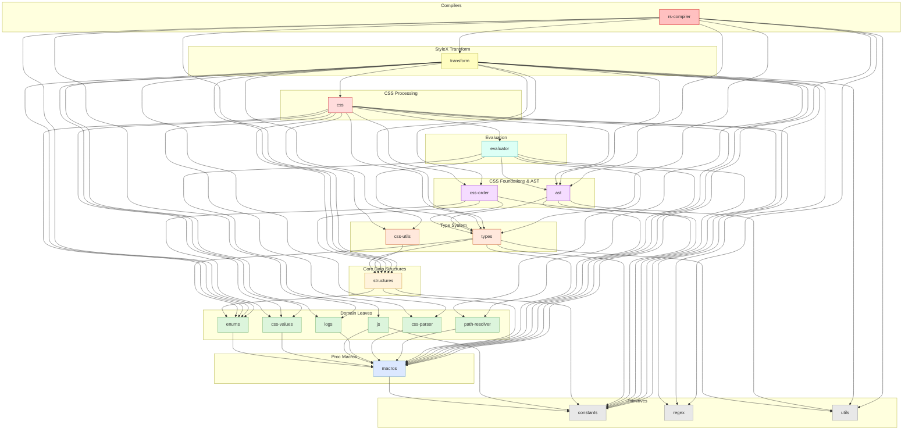

# `stylex-structures`

> Part of the [StyleX SWC Plugin](https://github.com/Dwlad90/stylex-swc-plugin#readme) workspace

## Overview

Core data structures and configuration types for the StyleX compiler
pipeline. This crate defines the foundational structs — plugin state, style
representations, CSS ordering primitives, and compiler options — that every
higher-level crate depends on. It was isolated so that data definitions stay
decoupled from transform logic and CSS generation, enabling six downstream
crates to share a single source of truth for configuration and state.

- **Plugin state & context** — `PluginPass`, `TopLevelExpression`,
  `UidGenerator` for tracking compilation state
- **Style representations** — `DynamicStyle`, `InlineStyle`,
  `StyleVarsToKeep`, `OrderPair` for modelling CSS artefacts
- **Configuration** — `StyleXOptions`, `StyleXOptionsParams`,
  `StyleXStateOptions`, `ModuleResolution` for compiler behaviour
- **Ordering traits** — `Order` trait and `PropertySpecificity`,
  `ShorthandsOfShorthands` implementations for CSS property expansion
- **Import management** — `NamedImportSource`, `ImportSources`,
  `RuntimeInjection` for tracking StyleX import sources
- **Environment** — `EnvEntry`, `JSFunction` for compile-time env
  configuration

## Architecture

- **Layer**: 3 — Core Data Structures
- **Depends on**:
  [`stylex-constants`](https://github.com/Dwlad90/stylex-swc-plugin/tree/develop/crates/stylex-constants),
  [`stylex-enums`](https://github.com/Dwlad90/stylex-swc-plugin/tree/develop/crates/stylex-enums),
  [`stylex-macros`](https://github.com/Dwlad90/stylex-swc-plugin/tree/develop/crates/stylex-macros)
- **Depended on by**:
  [`stylex-css`](https://github.com/Dwlad90/stylex-swc-plugin/tree/develop/crates/stylex-css),
  [`stylex-css-order`](https://github.com/Dwlad90/stylex-swc-plugin/tree/develop/crates/stylex-css-order),
  [`stylex-css-utils`](https://github.com/Dwlad90/stylex-swc-plugin/tree/develop/crates/stylex-css-utils),
  [`stylex-rs-compiler`](https://github.com/Dwlad90/stylex-swc-plugin/tree/develop/crates/stylex-rs-compiler),
  [`stylex-transform`](https://github.com/Dwlad90/stylex-swc-plugin/tree/develop/crates/stylex-transform),
  [`stylex-types`](https://github.com/Dwlad90/stylex-swc-plugin/tree/develop/crates/stylex-types)

### Key Exports

| Export | Kind | Purpose |
|--------|------|---------|
| `DynamicStyle` | struct | Dynamic style with expression, key, variable name, and file path |
| `InlineStyle` | struct | Inline style with path, original expression, and transformed expression |
| `NamedImportSource` | struct | Manages import sources for StyleX calls |
| `ImportSources` | enum | Distinguishes regular and named imports |
| `RuntimeInjection` | enum | Configures runtime CSS injection strategy |
| `Order` | trait | CSS property expansion interface implemented by ordering strategies |
| `OrderPair` | struct | Key-value pair `(String, Option<String>)` for property expansion |
| `Pair` | struct | Generic string key-value pair |
| `PluginPass` | struct | Compilation context: CWD and source file name |
| `PropertySpecificity` | struct | `Order` impl for specificity-based resolution |
| `ShorthandsOfShorthands` | struct | `Order` impl for nested shorthand expansion |
| `StyleVarsToKeep` | struct | CSS variable properties to preserve during compilation |
| `EnvEntry` | enum | Compile-time environment entry (static or callable) |
| `JSFunction` | struct | Callable JS function for expression transforms |
| `StyleXOptions` | struct | Resolved compiler options |
| `StyleXOptionsParams` | struct | Raw user-facing compiler options |
| `StyleXStateOptions` | struct | Serialisable runtime state options |
| `ModuleResolution` | struct | Module resolution configuration |
| `TopLevelExpression` | struct | Top-level AST expression with kind and optional atom |
| `UidGenerator` | struct | Thread-safe unique identifier generator |

### Modules

| Module | Description |
|--------|-------------|
| `dynamic_style` | Dynamic style expression representation |
| `inline_style` | Inline style path and expression tracking |
| `named_import_source` | Import source and runtime injection management |
| `order` | `Order` trait for CSS property expansion strategies |
| `order_pair` | `OrderPair` tuple struct for expansion results |
| `pair` | Generic key-value pair |
| `plugin_pass` | Compilation context (CWD, file name) |
| `property_specificity` | Specificity-based `Order` implementation |
| `shorthands_of_shorthands` | Nested-shorthand `Order` implementation |
| `style_vars_to_keep` | CSS variable preservation tracking |
| `stylex_env` | Compile-time environment entries and JS functions |
| `stylex_options` | Compiler options, module resolution, validation modes |
| `stylex_state_options` | Serialisable runtime state options |
| `top_level_expression` | Top-level AST expression wrapper |
| `uid_generator` | Thread-safe UID generation (global, local, thread-local) |

## Dependency Graph

<details>
<summary><h3>Dependency Graph</h3></summary>



</details>

---

## Development

```bash
make crate-structures-build    # Build the crate
make crate-structures-lint     # Lint with Clippy
make crate-structures-docs     # Generate rustdoc
```

## License

MIT — see [LICENSE](https://github.com/Dwlad90/stylex-swc-plugin/blob/develop/LICENSE)
