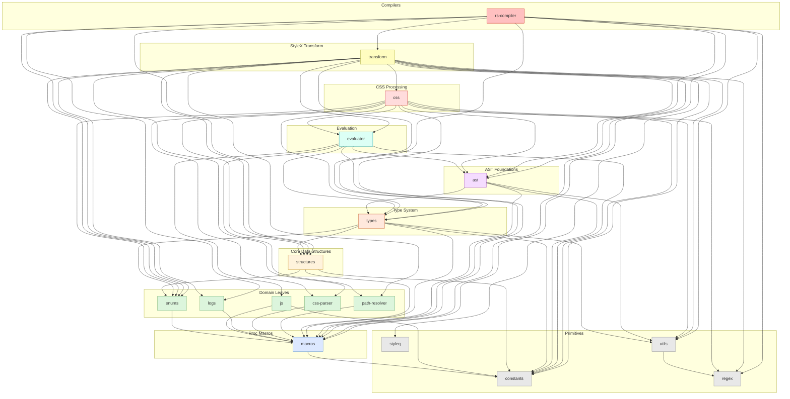

# `stylex-styleq`

> Part of the
> [StyleX SWC Plugin](https://github.com/Dwlad90/stylex-swc-plugin#readme)
> workspace

## Overview

Rust port of the [`styleq`](https://github.com/necolas/styleq) class-name merger
used by the StyleX runtime. `styleq` walks an array of (possibly nested)
compiled style objects, merges their atomic class names with last-write-wins
semantics on the underlying CSS property, and returns the final `class` string
plus any inline-style fallback. This crate provides the same algorithm in Rust
so the SWC transform can perform the merge **at compile time** and emit a
literal class string instead of leaving a `styleq()` call in the bundle.

- **JS-parity behavior** — line-for-line port of `styleq/src/styleq.js`,
  including handling of nested arrays, `false`/`null` inputs, the `$$css`
  (`COMPILED_KEY`) marker, and inline-style fallback when a non-compiled object
  is encountered (`disable_mix`, `dedupe_class_name_chunks` options match the JS
  API).
- **Generic over the value type** — the `StyleqValue` trait abstracts away what
  a "style value" is, with a built-in `StyleValue` enum that covers the common
  case (string class names, `null`, booleans, numbers, etc.). Consumers can plug
  in their own AST-aware value type without forking the algorithm.
- **Thread-safe cache** — class-name chunks are memoised in an `RwLock` over an
  `FxHashMap` keyed either by stable identity (`Identity(usize)`) or by a
  structural `FxHasher` digest (`Hash(u64)`). The cache transparently recovers
  from a poisoned lock so a single panicking writer can never permanently
  disable caching for the rest of the process.
- **Allocation-conscious** — cache entries are stored behind `Arc`, so a hit is
  a refcount bump rather than a deep clone of three owned strings plus a
  property `Vec`. Property-membership lookups use an `FxHashSet<Arc<str>>` for
  O(1) "have I seen this prop?" checks (vs. the previous O(n) `Vec::contains`),
  and the `Arc<str>` for each property name is allocated once and shared between
  the membership set and the cache chunk.
- **`Send + Sync` guarantees** — `CacheEntry` and `CacheKey` are
  compile-time-asserted `Send + Sync` so the cache layer is safe to share across
  threads when SWC is driven by Rayon/Tokio for parallel file processing.

## Public API

- `styleq(&[StyleqInput<V>]) -> StyleqResult<V>` — convenience entry point using
  the default options and a freshly-constructed cache.
- `create_styleq(options) -> Styleq<V>` — build a long-lived `Styleq` with a
  persistent cache and custom
  `StyleqOptions { disable_cache, disable_mix, dedupe_class_name_chunks, transform }`.
- `Styleq::styleq(&self, &[A]) -> StyleqResult<V>` — run the merge against a
  caller-supplied argument type implementing `StyleqArgument<V>`.
- Traits: `StyleqValue` (what is a style value?), `StyleqArgument` (what is a
  `styleq` argument? — supports nested arrays, identity-based cache keys, and
  skip flags).
- Built-in implementations: `StyleValue` enum + `StyleqInput<V>` enum cover the
  runtime-style use case so consumers don't have to define their own types for
  tests, benchmarks, or simple transforms.
- Result: `StyleqResult { class_name, inline_style, data_style_src }`.

## Architecture

- **Layer**: 0 — Primitives (no internal deps)
- **Depends on**: None (leaf crate; only `indexmap`, `log`, `rustc-hash` from
  the workspace dependency set)
- **Depended on by**:
  [`stylex-transform`](https://github.com/Dwlad90/stylex-swc-plugin/tree/develop/crates/stylex-transform)
  — used by the compile-time `styleq` transformer to fold `styleq()` calls into
  static class strings.

## Testing & Benchmarks

- Integration tests in `tests/styleq_test.rs` mirror the JS `styleq.test.js`
  suite case-by-case and additionally cover Rust-specific concerns
  (poisoned-lock recovery, `Send + Sync` of cache types, `Rc`/`Arc` value
  blanket impls).
- Criterion benchmarks in `benches/performance_bench.rs` exercise both the cold
  and hot cache paths against representative compiled-style fixtures.

```sh
pnpm run --filter=@stylexswc/stylex-styleq test
pnpm run --filter=@stylexswc/stylex-styleq bench
```

## Dependency Graph

<details>
<summary><h3>Dependency Graph</h3></summary>



</details>

## License

MIT — see
[LICENSE](https://github.com/Dwlad90/stylex-swc-plugin/blob/develop/LICENSE)
