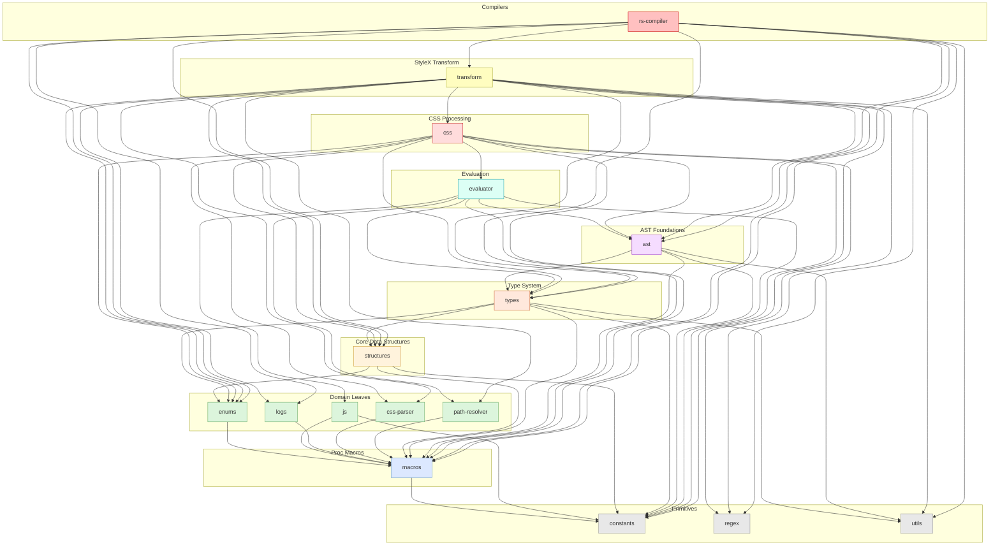

# StyleX Test Parser

> Part of the
> [StyleX SWC Plugin](https://github.com/Dwlad90/stylex-swc-plugin#readme)
> workspace

## Overview

Standalone CLI tool that parses Jest tests from the official
[StyleX](https://github.com/facebook/stylex) repository to maintain
compatibility between this unofficial SWC plugin and Meta's official StyleX
library. It is **not** part of the compiler pipeline DAG — it has zero internal
crate dependencies and nothing depends on it. The tool exists purely as a
development-time utility to keep the SWC plugin's test suite synchronised with
upstream changes in the official StyleX repo.

- **Automated test extraction** — walks the official StyleX repository tree and
  extracts Jest test files, converting them into a format consumable by this
  workspace's test harness.
- **Compatibility tracking** — by re-running the parser after upstream StyleX
  releases, developers can immediately see which tests have been added,
  modified, or removed via `git diff`.
- **Version awareness** — enables the team to stay current with new StyleX
  features and API changes by surfacing test-level deltas.
- **Zero internal dependencies** — the tool depends only on external crates
  (e.g., `clap`, `serde`, standard I/O) and can be built and run independently
  of the compiler pipeline.

## Architecture

- **Layer**: — _(standalone CLI, not part of the compiler pipeline DAG)_
- **Depends on**: None (no internal workspace crate dependencies)
- **Depended on by**: None

## Features

- **Test Parsing**: Extracts tests from the official StyleX repository.
- **Compatibility Checks**: Assists in ensuring compatibility between the StyleX
  SWC plugin and official StyleX tests.
- **Version Tracking**: Enables you to stay updated with changes in StyleX tests
  and features.

## Using the CLI

1. Compile release version of the CLI app by running next command:
   `pnpm --filter=@stylexswc/test-parser run build`
2. Clone official StyleX [repo](https://github.com/facebook/stylex), preferably
   next to this repository or update it if exist
3. Run next command `pnpm --filter=@stylexswc/test-parser start` for parsing
   tests
4. Check `git diff` to see updates and changes to tests
5. Coding new features

## CLI Arguments

_-p, --stylex-path `PATH`_ - Absolute or relative path to cloned
[StyleX](https://github.com/facebook/stylex) repository. Default value:
`../../../stylex/packages`

> [!NOTE] All parsed tests are saved in the
> [**tests**](https://github.com/Dwlad90/stylex-swc-plugin/tree/develop/crates/stylex-test-parser/output/__tests__)
> directory separated by the source package name.

## Dependency Graph

<details>
<summary><h3>Dependency Graph</h3></summary>



</details>

## Development

```bash
# Build
make crate-test-parser-build

# Lint
make crate-test-parser-lint

# Generate docs
make crate-test-parser-docs
```

## License

MIT — see
[LICENSE](https://github.com/Dwlad90/stylex-swc-plugin/blob/develop/LICENSE)
