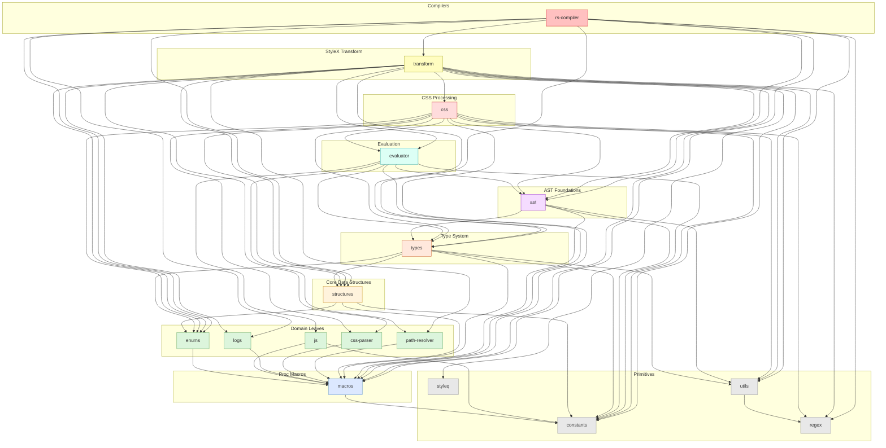

# `stylex-transform`

> Part of the
> [StyleX SWC Plugin](https://github.com/Dwlad90/stylex-swc-plugin#readme)
> workspace

## Overview

Main SWC transform orchestration crate for the StyleX compiler. This is the
**largest** crate in the workspace (108 files, ~27,700 lines) and replaces the
former `stylex-shared` monolith. It owns the `StyleXTransform` entry point
struct, the central `StateManager`, the SWC `Fold` visitor implementation, and
every piece of logic that depends on per-file compiler state. All other crates
in the pipeline are stateless utilities; `stylex-transform` is where stateful
orchestration happens.

- **`StyleXTransform` entry point** — the single public struct that implements
  SWC's `Fold` trait, serving as the bridge between the NAPI-RS compiler layer
  and the internal transform pipeline.
- **`StateManager`** — central state holder for each file compilation, tracking
  declarations, injected styles, metadata, theme variables, and generated class
  names.
- **21 `fold_*` visitors** — fine-grained SWC `Fold` implementations for every
  relevant AST node type (`fold_module`, `fold_call_expr`,
  `fold_var_declarator`, etc.), each in its own module for readability.
- **StyleX API transformers** — dedicated modules for every StyleX API surface:
  `stylex.create`, `stylex.defineVars`, `stylex.keyframes`,
  `stylex.createTheme`, `stylex.positionTry`, `stylex.viewTransitionClass`, and
  more.
- **`styleq` compatibility layer** — runtime-compatible `styleq()` transform
  that merges class name arrays at compile time.
- **High-level transformer pipeline** — 10+ transformer modules that compose
  lower-level utilities into end-to-end API call transformations.
- **Comprehensive utility suites** — AST helpers, CSS processing utilities, JS
  evaluation helpers, and core transform utilities (flatten, merge, class name
  generation).

## Architecture

- **Layer**: 8 — StyleX Transform
- **Depends on** (all 14 other internal crates):
  [`stylex-ast`](https://github.com/Dwlad90/stylex-swc-plugin/tree/develop/crates/stylex-ast),
  [`stylex-constants`](https://github.com/Dwlad90/stylex-swc-plugin/tree/develop/crates/stylex-constants),
  [`stylex-css`](https://github.com/Dwlad90/stylex-swc-plugin/tree/develop/crates/stylex-css),
  [`stylex-css-parser`](https://github.com/Dwlad90/stylex-swc-plugin/tree/develop/crates/stylex-css-parser),
  [`stylex-enums`](https://github.com/Dwlad90/stylex-swc-plugin/tree/develop/crates/stylex-enums),
  [`stylex-evaluator`](https://github.com/Dwlad90/stylex-swc-plugin/tree/develop/crates/stylex-evaluator),
  [`stylex-logs`](https://github.com/Dwlad90/stylex-swc-plugin/tree/develop/crates/stylex-logs),
  [`stylex-macros`](https://github.com/Dwlad90/stylex-swc-plugin/tree/develop/crates/stylex-macros),
  [`stylex-path-resolver`](https://github.com/Dwlad90/stylex-swc-plugin/tree/develop/crates/stylex-path-resolver),
  [`stylex-regex`](https://github.com/Dwlad90/stylex-swc-plugin/tree/develop/crates/stylex-regex),
  [`stylex-structures`](https://github.com/Dwlad90/stylex-swc-plugin/tree/develop/crates/stylex-structures),
  [`stylex-styleq`](https://github.com/Dwlad90/stylex-swc-plugin/tree/develop/crates/stylex-styleq),
  [`stylex-types`](https://github.com/Dwlad90/stylex-swc-plugin/tree/develop/crates/stylex-types),
  [`stylex-utils`](https://github.com/Dwlad90/stylex-swc-plugin/tree/develop/crates/stylex-utils)
- **Depended on by**:
  [`stylex-rs-compiler`](https://github.com/Dwlad90/stylex-swc-plugin/tree/develop/crates/stylex-rs-compiler)

#### `transform::stylex` — StyleX API call transformers

Dedicated transform modules for every public StyleX API:

- `create` — `stylex.create()` style object compilation
- `props` — `stylex.props()` property object compilation
- `define_vars` — `stylex.defineVars()` CSS custom property generation
- `define_consts` — `stylex.defineConsts()` CSS custom property generation
- `default_marker` — `stylex.defaultMarker()` default marker handling
- `define_marker` — `stylex.defineMarker()` define marker handling
- `env` — `stylex.env()` environment variable handling
- `keyframes` — `stylex.keyframes()` `@keyframes` rule generation
- `create_theme` — `stylex.createTheme()` theme override handling
- `position_try` — `stylex.positionTry()` anchor-positioning support
- `view_transition_class` — `stylex.viewTransitionClass()` view-transition name
  generation
- `when` — `stylex.when()` conditional style generation
- and additional API surface modules

#### `transform::styleq` — styleq compatibility layer

Compiles `styleq()` calls at build time, merging class name arrays so the
runtime `styleq` library is not required in production bundles.

#### `shared::structures::state_manager`

Central `StateManager` struct holding all per-file compiler state: declarations,
injected styles, metadata, theme variables, generated class names, and
configuration.

#### `shared::structures::functions`

Function type definitions and closure representations used during transformation
to model StyleX function arguments and return values.

#### `shared::transformers`

Ten high-level transformer modules that compose lower-level CSS, AST, and
evaluation utilities into complete API call transformations. Each transformer
corresponds to one StyleX API and is invoked by the `Fold` visitor when the
matching call expression is encountered.

#### `shared::utils::ast`

AST helper functions that depend on `StateManager`. These differ from the
stateless helpers in
[`stylex-ast`](https://github.com/Dwlad90/stylex-swc-plugin/tree/develop/crates/stylex-ast)
because they read or mutate compiler state while manipulating the AST.

#### `shared::utils::css`

CSS processing utilities, validators, and normalizers used during the transform
phase. Builds on top of
[`stylex-css`](https://github.com/Dwlad90/stylex-swc-plugin/tree/develop/crates/stylex-css)
with additional state-aware logic.

#### `shared::utils::js`

JavaScript evaluation utilities — `evaluate`, `check_declaration`,
`native_functions` — that interpret JS expressions at compile time to resolve
constant values.

#### `shared::utils::core`

Core transform utilities for flattening nested style objects, merging
declarations, and generating deterministic class names.

#### `shared::enums::data_structures`

Transform-specific enum types that model intermediate data structures used
exclusively within the transform pipeline.

## Dependency Graph

<h3>Dependency Graph</h3>

## License

MIT — see
[LICENSE](https://github.com/Dwlad90/stylex-swc-plugin/blob/develop/LICENSE)
