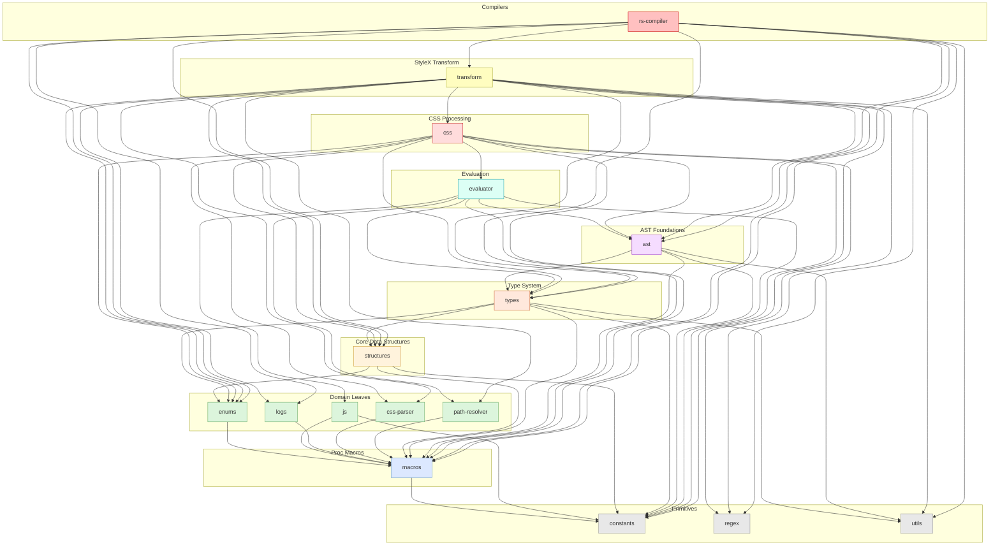

# `stylex-types`

> Part of the
> [StyleX SWC Plugin](https://github.com/Dwlad90/stylex-swc-plugin#readme)
> workspace

## Overview

Injectable style types and metadata structures for the StyleX compiler. This
crate defines the `InjectableStyle` family of structs and enums, the `MetaData`
output type, and the `StyleOptions` trait that decouples function-pointer types
from `StateManager`. It was extracted so that every crate needing compiled-style
representations can depend on a slim type package without pulling in transform
logic — six downstream crates import these types directly.

- **Injectable styles** — `InjectableStyle`, `InjectableConstStyle` and their
  `Base` counterparts provide LTR/RTL CSS content with optional priority and
  const-variable tracking
- **Enum wrappers** — `InjectableStyleKind` and `InjectableStyleBaseKind`
  distinguish regular styles from const-referencing styles
- **Metadata** — `MetaData` pairs a CSS class name with its injectable style and
  priority, supporting custom serialisation
- **Trait interface** — `StyleOptions` is an object-safe trait that exposes a
  minimal API for CSS generation without depending on the concrete
  `StateManager`
- **Type alias** — `InjectableStylesMap`
  (`IndexMap<String, Rc<InjectableStyleKind>>`) provides ordered,
  reference-counted style storage

## Architecture

- **Layer**: 4 — Type System
- **Depends on**:
  [`stylex-constants`](https://github.com/Dwlad90/stylex-swc-plugin/tree/develop/crates/stylex-constants),
  [`stylex-enums`](https://github.com/Dwlad90/stylex-swc-plugin/tree/develop/crates/stylex-enums),
  [`stylex-macros`](https://github.com/Dwlad90/stylex-swc-plugin/tree/develop/crates/stylex-macros),
  [`stylex-structures`](https://github.com/Dwlad90/stylex-swc-plugin/tree/develop/crates/stylex-structures),
  [`stylex-utils`](https://github.com/Dwlad90/stylex-swc-plugin/tree/develop/crates/stylex-utils)
- **Depended on by**:
  [`stylex-ast`](https://github.com/Dwlad90/stylex-swc-plugin/tree/develop/crates/stylex-ast),
  [`stylex-css`](https://github.com/Dwlad90/stylex-swc-plugin/tree/develop/crates/stylex-css),
  [`stylex-evaluator`](https://github.com/Dwlad90/stylex-swc-plugin/tree/develop/crates/stylex-evaluator),
  [`stylex-rs-compiler`](https://github.com/Dwlad90/stylex-swc-plugin/tree/develop/crates/stylex-rs-compiler),
  [`stylex-transform`](https://github.com/Dwlad90/stylex-swc-plugin/tree/develop/crates/stylex-transform)

### `StyleOptions` Trait

The `StyleOptions` trait solves a circular-dependency problem: function pointer
types and `StateManager` live in different crates.

```text
┌──────────────┐         ┌─────────────────────┐
│  stylex-css  │──uses──▶│  dyn StyleOptions    │
│  stylex-ast  │         │  (object-safe trait) │
└──────────────┘         └──────────┬────────────┘
                                    │ implements
                         ┌──────────▼────────────┐
                         │  StateManager          │
                         │  (stylex-transform)    │
                         └────────────────────────┘
```

Key methods on the trait:

- `options(&self) -> &StyleXStateOptions`
- `css_property_seen(&self)` / `css_property_seen_mut(&mut self)`
- `other_injected_css_rules(&self)` / `other_injected_css_rules_mut(&mut self)`
- `as_any_mut(&mut self)` — downcast bridge for controlled migration

## Dependency Graph

<details>
<summary><h3>Dependency Graph</h3></summary>



</details>

---

## License

MIT — see
[LICENSE](https://github.com/Dwlad90/stylex-swc-plugin/blob/develop/LICENSE)
