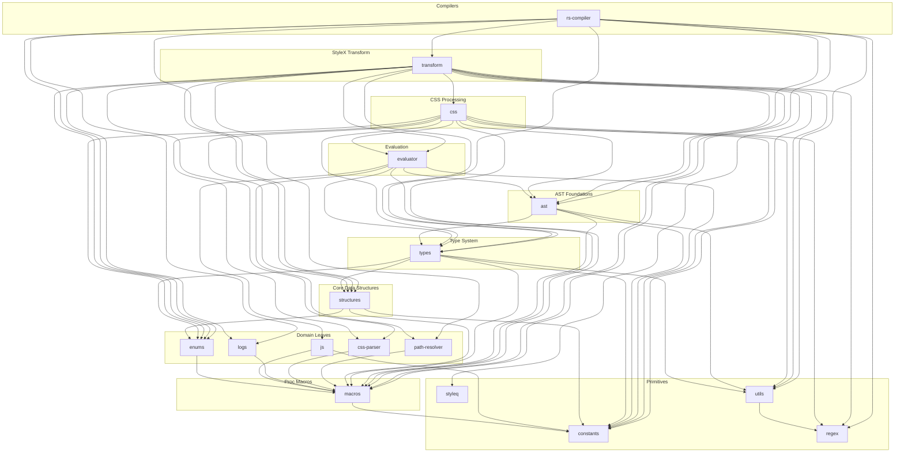

# Project Structure

Monorepo with `pnpm` workspaces (`pnpm-workspace.yaml`): `apps/*`, `crates/*`,
`packages/*`. Turbo (`turbo.json`) orchestrates all tasks.

## Rust Crates (`crates/`)

Atomic crates arranged in a strict dependency DAG (higher layers depend only on
lower layers). Each crate owns exactly one concern -- no re-export facades, no
mixed-domain files.

**Layer 0 -- Primitives (no internal dependencies):**

- `stylex-constants` -- static lookup tables, keyword sets, and compile-time
  constants
- `stylex-regex` -- pre-compiled `lazy_static!` regex patterns for CSS value
  matching
- `stylex-styleq` -- Rust port of the runtime
  [`styleq`](https://github.com/necolas/styleq) class-name merger
- `stylex-utils` -- lightweight SWC AST helpers

**Layer 1 -- Macros:**

- `stylex-macros` -- error-handling and diagnostic macros (`stylex_panic!`,
  `stylex_bail!`, `stylex_unwrap!`, etc.)

**Layer 2 -- Domain Leaves:**

- `stylex-enums` -- enum modules: `CSSSyntax`, `ValueWithDefault`,
  `ImportPathResolution`, `StyleVarsToKeep`, and more
- `stylex-js` -- JS runtime guard helpers (`is_valid_callee`,
  `is_mutation_expr`, `is_invalid_method`)
- `stylex-logs` -- structured logging with ANSI-colored `[StyleX]`-branded
  output for the NAPI-RS pipeline
- `stylex-css-parser` -- CSS value parser with type, property, and at-rule
  coverage
- `stylex-path-resolver` -- import path resolution with partial `package.json`
  exports support

**Layer 3 -- Core Data Structures:**

- `stylex-structures` -- foundational struct modules: `StylexOptions`,
  `UidGenerator`, `PluginPass`, `NamedImportSource`, `Order`, and more

**Layer 4 -- Type System:**

- `stylex-types` -- cross-coupled core types (`InjectableStyle*`, `MetaData`)
  and the `StyleOptions` trait

**Layer 5 -- AST Foundations:**

- `stylex-ast` -- SWC AST factory and convertor functions (semantically named
  `create_*`, `convert_*`)

**Layer 6 -- Evaluation:**

- `stylex-evaluator` -- pure JS expression evaluator; no transform side effects

**Layer 7 -- CSS Processing:**

- `stylex-css` -- unified CSS processing: generation (LTR/RTL), whitespace
  normalization, value parsing, property ordering strategies, and pseudo-class
  selector utilities

**Layer 8 -- StyleX Transform:**

- `stylex-transform` -- main SWC transform: `StyleXTransform`, `StateManager`,
  SWC `Fold` visitor, and all injection logic

**Layer 9 -- Compilers (top-level consumers):**

- `stylex-rs-compiler` -- NAPI-RS compiler exposing the full pipeline to Node.js

Workspace dependencies are defined in the root `Cargo.toml`.

<details>
<summary>Dependency graph</summary>



</details>

## TS/JS Packages (`packages/`)

Integration plugins:

- `nextjs-plugin`, `postcss-plugin`, `unplugin`, `webpack-plugin`,
  `rollup-plugin`, `turbopack-plugin`, `jest`

Shared configs:

- `eslint-config`, `typescript-config`, `playwright`, `design-system`

## Example Apps (`apps/`)

20+ apps covering Next.js, Vite, Webpack, Rollup, Rspack, Rsbuild, Farm,
esbuild, Vue, Solid, and Storybook integrations. Each has a
`playwright.config.ts` for visual testing.

## Testing & Coverage Infrastructure

### Test Runner: `cargo-nextest`

All Rust tests use [`cargo-nextest`](https://nexte.st/) as the primary test
runner. Configuration lives in `.config/nextest.toml`.

- **Workspace tests:** `cargo nextest run --workspace --all-features`
- **Doc tests:** `cargo test --doc --workspace --all-features` (nextest does not
  support doc tests; `cargo test --doc` is used separately)
- **Per-crate tests:** `cargo nextest run --all-features` (from crate directory)
- **CI profile:** `cargo nextest run --profile ci` (retries flaky tests)

### Coverage: `cargo-llvm-cov`

Code coverage uses [`cargo-llvm-cov`](https://github.com/taiki-e/cargo-llvm-cov)
with LLVM source-based instrumentation. All flags are passed via CLI (no config
file).

- **Workspace coverage:**
  ```sh
  cargo llvm-cov nextest --workspace --all-features \
    --exclude stylex_logs --exclude stylex_compiler_rs \
    --exclude stylex_test_parser --exclude stylex_css_parser \
    --exclude stylex_transform \
    --fail-uncovered-lines 0 \
    --fail-uncovered-regions 0 \
    --fail-under-functions 0 \
    --ignore-filename-regex '<pattern>'
  ```
- **100% line coverage is enforced** via `--fail-uncovered-lines 0`.
- **Coverage exclusion:** Use `#[cfg_attr(coverage_nightly, coverage(off))]` on
  functions/impls that cannot be meaningfully tested (e.g., panic branches,
  mutex poisoning). On stable Rust this is a no-op; file-level exclusions via
  `--ignore-filename-regex` handle the rest. Do NOT add new exclusions without
  justification.

### Excluded from Coverage

These crates are excluded because they are either integration-level (tested via
other means) or thin wrappers:

- `stylex_logs` -- logging utilities
- `stylex_compiler_rs` -- NAPI-RS bindings
- `stylex_test_parser` -- test fixture parser
- `stylex_css_parser` -- CSS parser (tested independently)
- `stylex_transform` -- SWC transform (tested via snapshot tests)

## Key Config Files

- `Cargo.toml` -- Rust workspace definition and shared dependencies.
- `.config/nextest.toml` -- nextest test runner configuration.
- `pnpm-workspace.yaml` -- pnpm workspace globs.
- `turbo.json` -- task dependency graph and caching.
- `rust-toolchain.toml` -- Rust version and compilation targets.
- `rustfmt.toml` -- Rust formatting rules.
- `clippy.toml` -- Rust linting thresholds.
- `.prettierrc.js` -- TS/JS/MD formatting rules.
- `eslint.config.mjs` -- root ESLint config.
- `scripts/packages/` -- shared `scripty` build/check scripts used by most TS
  packages.
